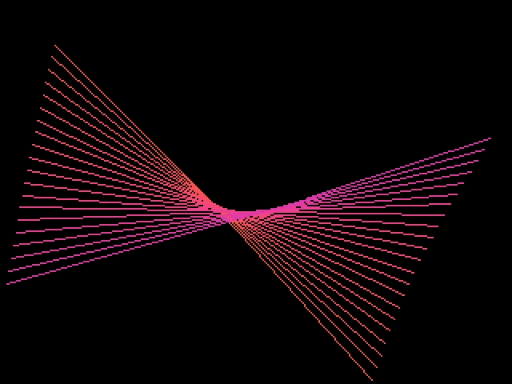
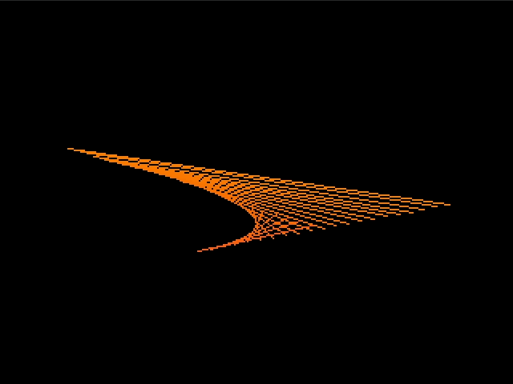
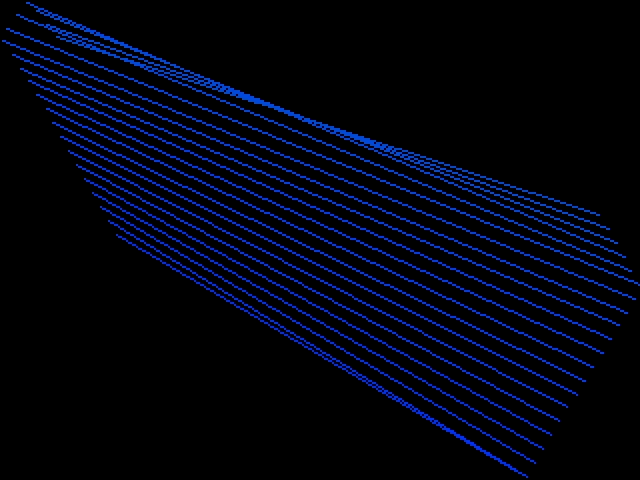
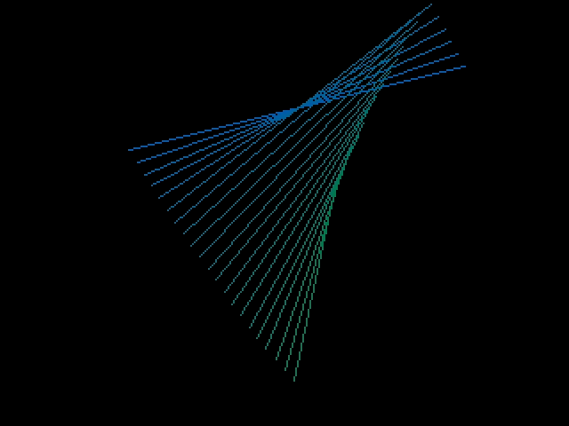

<!-- SPDX-License-Identifier: MIT -->
<!-- SPDX-FileCopyrightText: Copyright 2025 Sam Blenny -->
# Fruit Jam Lines Screensaver

This is a twisty-lines graphics toy inspired by retro screensavers from the
1990's (Macintosh After Dark 2 Night Lines, Windows 95 Mystify, etc). To make
the trail of lines, the code keeps track of two bouncing-ball style points and
draws a line between them. Each new line gets added to a list, and the oldest
line gets dropped off the end. The line colors cycle through a color swirl
palette generated from a gradient using the LCh color space.

This code was developed and tested on CircuitPython 10.0.0-alpha.7 with a Metro
RP2350 (no PSRAM version) and a pre-release revision B Fruit Jam prototype.
Keep in mind that things may change by the time CircuitPython 10.0.0 is
released.
